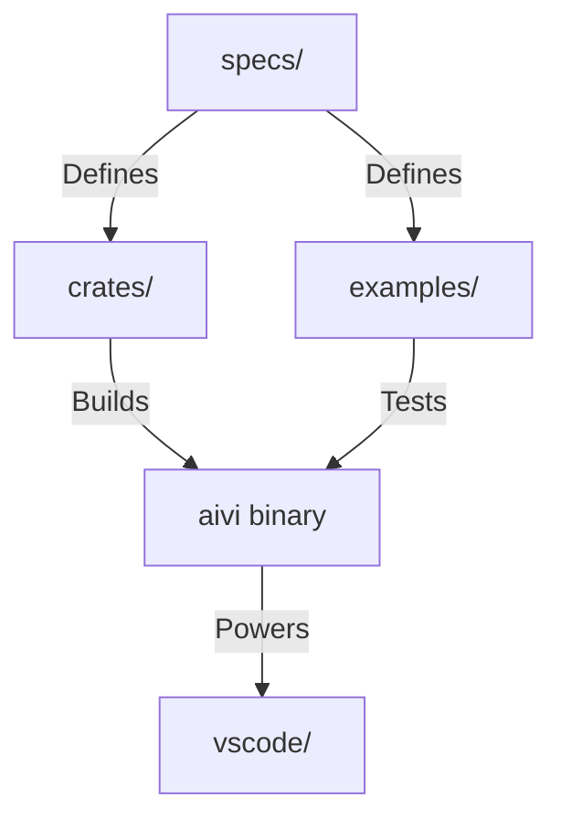

# AIVI Agent Guide

This document serves as the authoritative guide for AI agents working on the AIVI language project. It establishes the relationships between specifications, implementation crates, examples, and tooling, ensuring safe and consistent contributions.

## 1. Project Structure & Relationships

The AIVI repository is organized into distinct layers. Understanding these relationships is crucial for making correct changes.

### 1.1 Directory Map

| Directory | Role | Relationship |
| :--- | :--- | :--- |
| `specs/` | **Source of Truth** | All implementation logic MUST derive from here. If code contradicts specs, the code is wrong (or specs need updating first). |
| `crates/` | **Implementation** | The Rust codebase implementing the compiler, LSP, and runtime. |
| `examples/` | **Validation** | Canonical AIVI code demonstrating features. Used for integration testing and documentation. |
| `vscode/` | **Tooling** | Editor extension. Depends on `crates/aivi_lsp` and `specs/02_syntax` (grammar). |

### 1.2 Dependency Flow

## 2. Development Workflow

### 2.1 The Golden Rule
**Never invent syntax or features.**
Always verify against `specs/` before writing AIVI code or compiler logic. If a feature is missing from specs, ask for clarification or check `specs/roadmap/`.

### 2.2 Task Execution Protocol

1.  **Analyze**: Read the relevant `specs/` files first.
    *   *Syntax*: `specs/02_syntax/`
    *   *Semantics*: `specs/03_kernel/` & `specs/04_desugaring/`
    *   *Stdlib*: `specs/05_stdlib/`
2.  **Locate**: Identify the corresponding Rust crates in `crates/`.
    *   *Parsing*: `crates/aivi/src/parser` (or similar)
    *   *Typing*: `crates/aivi/src/ty`
    *   *LSP*: `crates/aivi_lsp`
3.  **Implement**: Make changes in small, testable units.
4.  **Verify**:
    *   Run `cargo test` in `crates/`.
    *   Check if `examples/` still compile/run (if applicable).
    *   Ensure `specs/` are updated if the change involves a design decision.

### 2.3 Clean as You Cook
Maintain hygiene in the codebase and documentation.
*   **Syntax Correction**: If you see syntax that violates the specs (e.g., `let x =` instead of `x =`, or `def foo()`), fix it immediately to match `specs/02_syntax`.
*   **Gap Filling**: If you encounter code using features not present in `specs/` or `examples/`, document them or add a test case.
*   **Refactoring**: Keep files small and readable. Propose splitting large files into logical units.

## 3. AIVI Language Best Practices

When writing or generating AIVI code (e.g., in `examples/` or tests), adhere to these principles derived from the specs.

### 3.1 Style & Syntax
*   **Identifiers**: `lowerCamelCase` for values/functions, `UpperCamelCase` for types/modules.
*   **Immutability**: Bindings are immutable. Use recursion or generators instead of loops.
*   **Pipelines**: Prefer `|>` for data transformations over nested calls.
    *   *Good*: `data |> filter valid |> map transform`
    *   *Bad*: `map transform (filter valid data)`
*   **Predicates**: Use implicit syntax for brevity where clear.
    *   *Good*: `filter (price > 100)`
    *   *Explicit*: `filter (x => x.price > 100)`
*   **Patching**: Use `<|` for record updates. Never manually reconstruct records.
    *   *Good*: `user <| { age: _ + 1 }`

### 3.2 Safety & Robustness
*   **No Nulls**: Always use `Option` or `Result`.
*   **Exhaustive Matching**: Ensure `case` or `?` covers all patterns. Use `_` only when necessary.
*   **Typed Errors**: Use `Result E A` with specific error types, not generic strings.
*   **Resources**: Use `resource { ... }` blocks for file/network handles to ensure cleanup.

### 3.3 Concurrency
*   **Structured**: Always spawn tasks within a scope (`concurrent.scope`).
*   **Communication**: Use channels (`Send`/`Recv`) for data exchange, not shared memory.

### 3.4 Decorators

This file applies to all of `specs/`.

- Decorators are reserved for **compiler/tooling pragmas** only (compile-time metadata).
- Do **not** add new integration-specific decorators (examples of forbidden patterns: `@sql`, `@schema`, `@table`, `@model`).
- Prefer **typed values** and **type-driven decoding/validation** at boundaries (e.g. `Source` configuration records, decoders derived from types).
- Only the decorators enumerated in `specs/02_syntax/14_decorators.md` are allowed in v0.1; unknown decorators should be considered a spec violation.

## 4. Rust Implementation Guidelines

When working on the compiler (`crates/`):

*   **Parser**: Must be error-tolerant (recover from syntax errors) to support LSP.
*   **CST vs AST**: Preserve full fidelity (whitespace/comments) in CST for formatting/refactoring.
*   **Diagnostics**: Emit rich error messages with spans and help text.
*   **Testing**:
    *   *Unit Tests*: For individual functions.
    *   *Snapshot Tests*: For parser/codegen output (use `insta` or similar if available).
    *   *Integration Tests*: Compile and run files from `examples/`.

### 4.1 Standard Library & Dependencies
*   **Rely on Battle-Tested Libraries**: When implementing standard library features, always prioritize established Rust crates.
*   **Avoid Reinventing the Wheel**: Do not implement complex algorithms (like FFT, crypto, etc.) from scratch if a robust Rust solution exists.
    *   *Example*: Use `rustfft` instead of implementing your own FFT.
*   Before implementing a new standard library feature, check that it has all the necessary primitives in the documentation. We want to keep it simple but not too limited.

## 5. Documentation Maintenance

*   **Specs**: Update `specs/` *before* or *alongside* code changes.
*   **Specs**: Update indices and make sure links are working.
*   **Roadmap**: Check `specs/roadmap/README.md` to align work with current phases.
*   **Guidelines**: Follow `.junie/guidelines.md`.
*   **AGENTS.md**: Update this file if workflows or structures change significantly.

## 6. Project Validation

To validate the project end-to-end, run these from the repo root:

1.  **All tests** (workspace): `cargo test --workspace`
2.  **Build all crates**: `cargo build --workspace`
3.  **Build VSCode extension**: `cd vscode && pnpm install && pnpm build`
4.  **Build docs site**: `cd specs && pnpm install && pnpm docs:build`

## 7. Safety Checklist

Before submitting changes:
- [ ] Did I check the specs?
- [ ] Did I run existing tests?
- [ ] Did I add a new test case?
- [ ] Is the code consistent with AIVI style?
- [ ] Did I avoid hallucinating features not in the roadmap?
- [ ] Did I update AIVI_LANGUAGE.md for LLM use?
